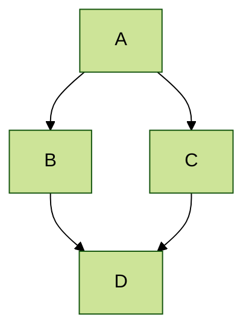



## 关键文件/目录位置

* 基本配置选项：_config.yml
* 顶部导航栏配置：_data/navigation.yml
* 单独页面：_pages/
* 页面集合为 .md 或 .html 文件，位于：
  * _publications/
  * _portfolio/
  * _posts/
  * _teaching/
  * _talks/
* 页脚：_includes/footer.html
* 静态文件（如 PDF）：/files/
* 个人头像（可在 _config.yml 设置）：images/profile.png

## 小贴士与建议

* 文件名以 ".md" 结尾会以 markdown 渲染，".html" 结尾则以 HTML 渲染。
* 查看 [提交列表](https://github.com/academicpages/academicpages.github.io/commits/master)（在你的仓库）可找到 GitHub 用 Jekyll 构建的最后版本。
  * 绿色对勾：构建成功
  * 橙色圆圈：正在构建
  * 红色 X：出错
  * 无图标：未构建

* Academic Pages 使用 [Jekyll Kramdown](https://jekyllrb.com/docs/configuration/markdown/) 和 GitHub Flavored Markdown (GFM) 解析器，和 GitHub 上的 Markdown 类似，但有些细微差别。
  * 部分 GitHub 表情支持 [Jemoji](https://github.com/jekyll/jemoji) 插件 :computer:。
  * 最全的表情列表见 [Emojis for Jekyll via Jemoji](https://www.fabriziomusacchio.com/blog/2021-08-16-emojis_for_Jekyll/#computer) 博客。

* GitHub Pages 不支持服务端代码，但支持客户端脚本。
  * 这意味着支持 Google Analytics，最新设置方法见 [wiki](https://github.com/academicpages/academicpages.github.io/wiki/Adding-Google-Analytics)。

* 你的简历可以用 Markdown 编写（[预览](https://academicpages.github.io/cv/)），也可以用 JSON 生成（[预览](https://academicpages.github.io/cv-json/)），布局略有不同。可在 `_data/navigation.yml` 中设置使用哪种，JSON 格式简历默认隐藏。

 * [Liquid 语法指南](https://shopify.github.io/liquid/tags/control-flow/) 对于想扩展模板或参与 [GitHub 模板](https://github.com/academicpages/academicpages.github.io) 的贡献者很有用。

## MathJax 数学公式

模板内置对 MathJax（3.* 版，通过 [jsDelivr](https://www.jsdelivr.com/)，[文档](https://docs.mathjax.org/en/latest/)）的支持：

$$
\displaylines{
\nabla \cdot E= \frac{\rho}{\epsilon_0} \\
\nabla \cdot B=0 \\
\nabla \times E= -\partial_tB \\
\nabla \times B  = \mu_0 \left(J + \varepsilon_0 \partial_t E \right)
}
$$

默认支持 `$$...$$` 和 `\\[...\\]` 作为块级数学公式，行内公式请用 `\\(...\\)`（如 \(a^2 + b^2 = c^2\)）。

**注意** Academic Pages 使用的 Markdown 会与 MathJax/LaTeX 的转义和换行有冲突，[有些解决方法](https://math.codidact.com/posts/278763/278772#answer-278772)。如在发表成果的 `citation` 字段中用 MathJax，建议用 `\(...\)`。

## Mermaid 流程图
Academic Pages 支持 [Mermaid 流程图](https://mermaid.js.org/)（11.* 版，通过 [jsDelivr](https://www.jsdelivr.com/)），基础语法如下：

```markdown
    ```mermaid
    graph LR
    A-->B
    ```
```

会生成如下流程图（应用默认主题）：


更高级的 `forest` 主题示例：



## Plotly 绘图
Academic Pages 支持通过 Markdown 代码块插入 Plotly 图表，熟悉 HTML/JS 也可[直接用 Plotly](https://plotly.com/javascript/getting-started/)。

Markdown 方式如下：

```markdown
    ```plotly
    {
      "data": [
        {
          "x": [1, 2, 3, 4],
          "y": [10, 15, 13, 17],
          "type": "scatter"
        },
        {
          "x": [1, 2, 3, 4],
          "y": [16, 5, 11, 9],
          "type": "scatter"
        }
      ]
    }
    ```
```

**重要！** 数据需为 JSON 格式，所有键都要加引号。建议用 [JSONLint](https://jsonlint.com/) 检查语法。
{: .notice}

会生成如下图表：
```plotly
{
  "data": [
    {
      "x": [1, 2, 3, 4],
      "y": [10, 15, 13, 17],
      "type": "scatter"
    },
    {
      "x": [1, 2, 3, 4],
      "y": [16, 5, 11, 9],
      "type": "scatter"
    }
  ]
}
```

本质上是将 [Plotly 属性](https://plotly.com/javascript/reference/index/) 作为 JSON 数据解析并传递给 Plotly，主题自动适配当前站点（亮色/暗色）。所有能用 `data` 属性描述的图都可渲染，但主题有一定限制。

```plotly
{
  "data": [
    {
      "x": [1, 2, 3, 4, 5],
      "y": [1, 6, 3, 6, 1],
      "mode": "markers",
      "type": "scatter",
      "name": "团队A",
      "text": ["A-1", "A-2", "A-3", "A-4", "A-5"],
      "marker": { "size": 12 }
    },
    {
      "x": [1.5, 2.5, 3.5, 4.5, 5.5],
      "y": [4, 1, 7, 1, 4],
      "mode": "markers",
      "type": "scatter",
      "name": "团队B",
      "text": ["B-a", "B-b", "B-c", "B-d", "B-e"],
      "marker": { "size": 12 }
    }    
  ],
  "layout": {
    "xaxis": {
      "range": [ 0.75, 5.25 ]
    },
    "yaxis": {
      "range": [0, 8]
    },
    "title": {"text": "数据标签悬停"}
  }
}
```

```plotly
{
  "data": [{
      "x": [1, 2, 3],
      "y": [4, 5, 6],
      "type": "scatter"
    },
    {
      "x": [20, 30, 40],
      "y": [50, 60, 70],
      "xaxis": "x2",
      "yaxis": "y2",
      "type": "scatter"
  }],
  "layout": {
    "grid": {
      "rows": 1,
      "columns": 2,
      "pattern": "independent"
    },
    "title": {
      "text": "简单子图"
    }    
  }
}
```

```plotly
{
  "data": [{
		"z": [[10, 10.625, 12.5, 15.625, 20],
          [5.625, 6.25, 8.125, 11.25, 15.625],
          [2.5, 3.125, 5.0, 8.125, 12.5],
          [0.625, 1.25, 3.125, 6.25, 10.625],
          [0, 0.625, 2.5, 5.625, 10]],
		"type": "contour"
	}],
  "layout": {
    "title": {
      "text": "基础等高线图"
    }
  }
}
```

## Markdown 语法指南

Academic Pages 使用 [kramdown](https://kramdown.gettalong.org/index.html) 渲染 Markdown，与 GitHub 等实现略有不同。完整文档见 [kramdown 语法页面](https://kramdown.gettalong.org/syntax.html)。  

### 三级标题

#### 四级标题

##### 五级标题

###### 六级标题

## 引用块

单行引用：

> 引用很酷。

## 表格

### 表格1

| 条目            | 项目   |                                                              |
| --------         | ------ | ------------------------------------------------------------ |
| [张三](#)    | 2016   | 列表中项目的描述                          |
| [李四](#)    | 2019   | 列表中项目的描述                          |
| [王五](#)     | 2022   | 列表中项目的描述                          |

### 表格2

| 表头1 | 表头2 | 表头3 |
|:--------|:-------:|--------:|
| 单元格1   | 单元格2   | 单元格3   |
| 单元格4   | 单元格5   | 单元格6   |
|-----------------------------|
| 单元格1   | 单元格2   | 单元格3   |
| 单元格4   | 单元格5   | 单元格6   |
|=============================|
| 脚注1   | 脚注2   | 脚注3   |

## 定义列表

定义列表标题
:   定义列表内容。

初创公司
:   初创公司是指为寻找可复制和可扩展商业模式而设立的公司或临时组织。

#努力工作
:   由 Rob Dyrdek 和他的保镖 Christopher "Big Black" Boykins 创造，"Do Work" 是一种自我激励，也可以激励朋友。

现场操作
:   让 Bill O'Reilly [来解释](https://www.youtube.com/watch?v=O_HyZ5aW76c "We'll Do It Live")。

## 无序列表（嵌套）

  * 列表项一 
      * 列表项一 
          * 列表项一
          * 列表项二
          * 列表项三
          * 列表项四
      * 列表项二
      * 列表项三
      * 列表项四
  * 列表项二
  * 列表项三
  * 列表项四

## 有序列表（嵌套）

  1. 列表项一 
      1. 列表项一 
          1. 列表项一
          2. 列表项二
          3. 列表项三
          4. 列表项四
      2. 列表项二
      3. 列表项三
      4. 列表项四
  2. 列表项二
  3. 列表项三
  4. 列表项四

## 按钮

为链接添加 `.btn` 类可突出显示。

## 提示

基础提示或强调内容可用如下语法：

```markdown
**注意！** 你也可以在段落后加 `{: .notice}` 来添加提示。
{: .notice}
```

渲染效果：

**注意！** 你也可以在段落后加 `{: .notice}` 来添加提示。
{: .notice}

### 脚注

脚注可用于文本补充说明或引用信息。[^1] Markdown 支持数字脚注，也支持文本脚注，只要名字唯一即可。[^note]

```markdown
这是正文内容。[^1] 这是更多正文内容。[^note]

[^1]: 这是脚注本身。
[^note]: 这是另一个脚注。
```

[^1]: 如本脚注。
[^note]: 脚注名如用文本，不能有空格。

## HTML 标签

### 地址标签

<address>
  1 Infinite Loop<br /> Cupertino, CA 95014<br /> 美国
</address>

### 链接标签

这是一个 [链接](http://github.com "GitHub") 示例。

### 缩写标签

缩写 CSS 代表 "层叠样式表"。

*[CSS]: 层叠样式表

### 引用标签

"代码即诗。" ---<cite>Automattic</cite>

### 代码标签

你将在后续测试中学到 `word-wrap: break-word;` 会是你的好朋友。

你也可以写大段代码，部分语言支持高亮，如 Python：

```python
print('Hello World!')
```

或 R：

```R
print("Hello World!", quote = FALSE)
```

### details 折叠标签

HTML `<details>` 标签可与 Markdown 配合，支持折叠内容，详见 [W3Schools](https://www.w3schools.com/tags/tag_details.asp)。

<details>
  <summary>默认折叠</summary>
  该部分默认折叠！
</details>

源码：

```HTML
<details>
  <summary>默认折叠</summary>
  该部分默认折叠！
</details>
```

如需默认展开，在标签中加 `open` 属性：

<details open>
  <summary>默认展开</summary>
  该部分因 &lt;details open&gt; 标签默认展开！
</details>


### 强调标签

强调标签会让文本 _斜体_。

### 插入标签

这个标签表示 <ins>插入的</ins> 文本。

### 键盘标签

这个标签模拟 <kbd>键盘文本</kbd>，通常样式与 `<code>` 标签类似。

### 预格式化标签

这个标签用于大段代码。

<pre>
.post-title {
  margin: 0 0 5px;
  font-weight: bold;
  font-size: 38px;
  line-height: 1.2;
  这里有一行很长很长很长的文本，用于测试 PRE 标签的显示和溢出效果；
}
</pre>

### 短引用标签

<q>开发者，开发者，开发者&#8230;</q> &#8211;Steve Ballmer

### 删除线标签

这个标签可以让你 <strike>删除文本</strike>。

### 粗体标签

这个标签显示 **加粗文本**。

### 下标标签

科学时间到：H<sub>2</sub>O，数字 "2" 应该下移。

### 上标标签

继续科学：牛顿的 E = MC<sup>2</sup>，数字 2 应该上移。

### 变量标签

用于表示 <var>变量</var>。

***
**脚注**

本页脚注内容如下，返回 <a href="#footnotes">Markdown 脚注</a> 部分。

